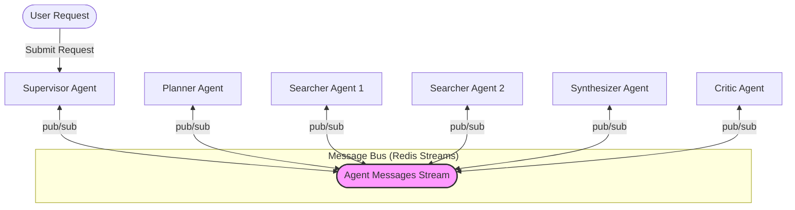

# Multi-Agent Web Research Pipeline

This project implements an autonomous web research pipeline driven by multiple specialized agents: Planner, Searcher, Synthesizer, Critic, and a Supervisor. The system orchestrates research workflows using Redis Streams for inter-agent communication, making it highly scalable and capable of high-throughput asynchronous execution.

## Architecture



## Agent Definitions

- **Supervisor Agent**: Tracks the state of all active requests, enforces global timeouts (5 minutes), and manages workflow progression and retries.
- **Planner Agent**: Decomposes a research topic into sub-queries and determines the search strategy based on the requested depth.
- **Searcher Agent**: Receives sub-queries, executes mock web searches (handling rate limits implicitly), and returns relevant URLs.
- **Synthesizer Agent**: Compiles search results, resolving conflicting information, and produces the structured report with citations.
- **Critic Agent**: Reviews the synthesized report, assesses confidence, and triggers a re-search loop (up to 2 iterations) if gaps or biases are detected.

## Performance Tuning for High Throughput

To meet the requirement of processing 100 topics within 10 minutes on a 4-core, 4GB memory constraint, the following optimizations were applied:

1. **Redis Streams and Consumer Groups**: Redis is used not just as a pub/sub mechanism but as a persistent stream with consumer groups. This allows the workload of specific roles (e.g., Searcher) to be automatically load-balanced across multiple worker instances (`Searcher 1`, `Searcher 2`).
2. **Connection Pooling**: `redis-py`'s `BlockingConnectionPool` ensures that agent threads don't exhaust connection limits when rapidly publishing or pulling messages under load.
3. **In-Memory Concurrency**: The agents run as independent background threads inside the main application process. Because the mock search and synthesis tasks simulate I/O delays (using `time.sleep`), Python's Global Interpreter Lock (GIL) is released, allowing true concurrency for I/O bound workloads.
4. **State Management Locks**: The Supervisor handles state updates concurrently by maintaining thread safety over its internal state dict using `threading.Lock()`.
5. **Memory Management**: Results are continuously written out to the disk (`results/` directory) and removed from the active in-memory state tracker, minimizing memory footprint over large workloads.

## Quick Start

The entire pipeline, including the Redis instance, is packaged via Docker.

### Requirements
- Docker and Docker Compose
- `make` and `bash`

### Commands

**Run the Full Workload (100 topics):**
```bash
make run
```

**Verify the Results:**
```bash
make verify
```

**Run Unit & Integration Tests:**
```bash
make test
```

**Clean Up:**
```bash
make clean
```
